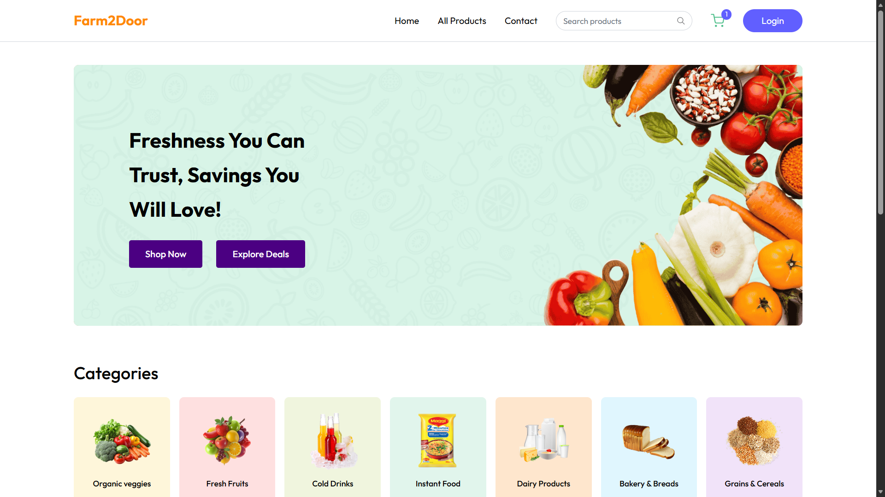
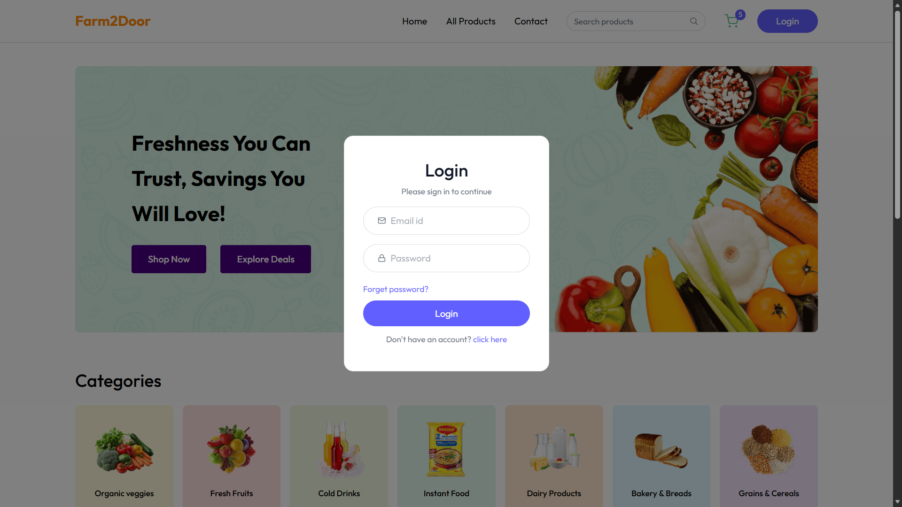
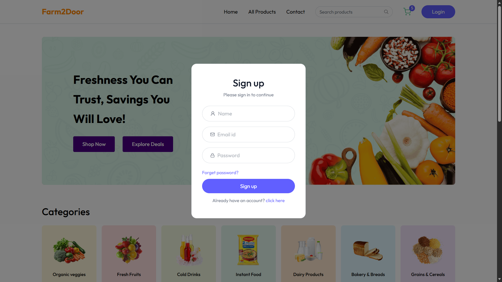
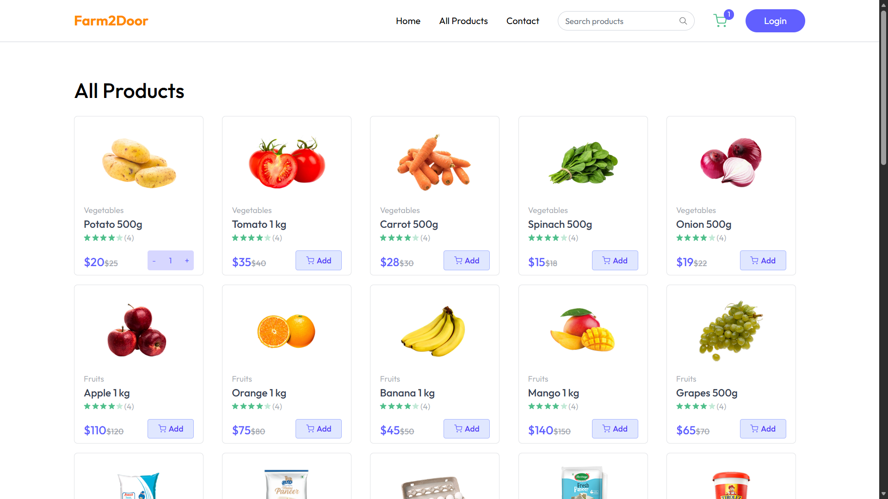
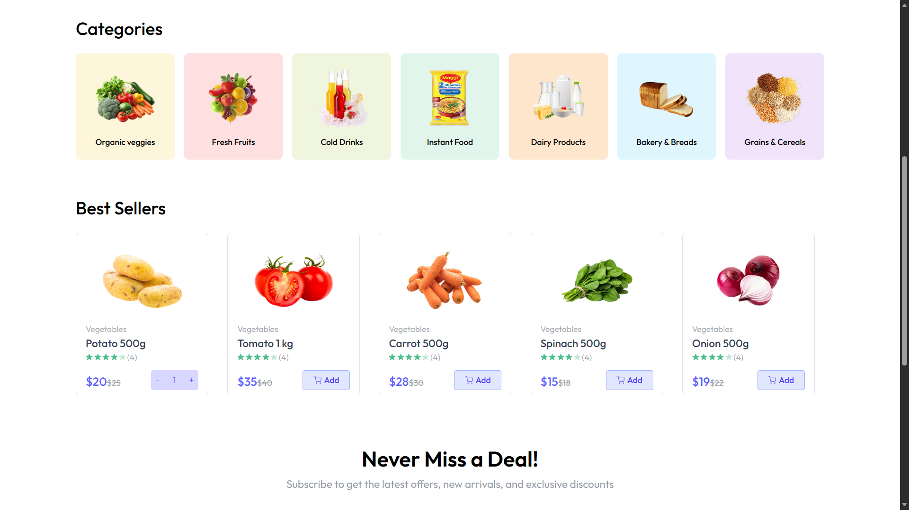
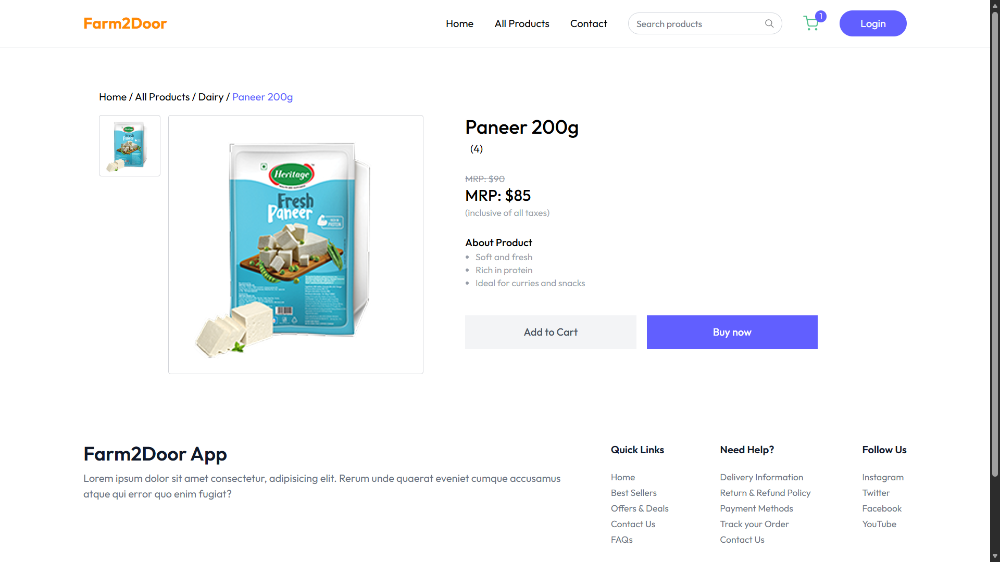
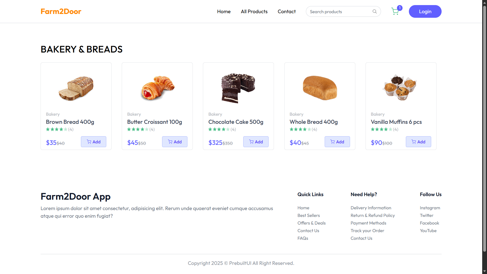
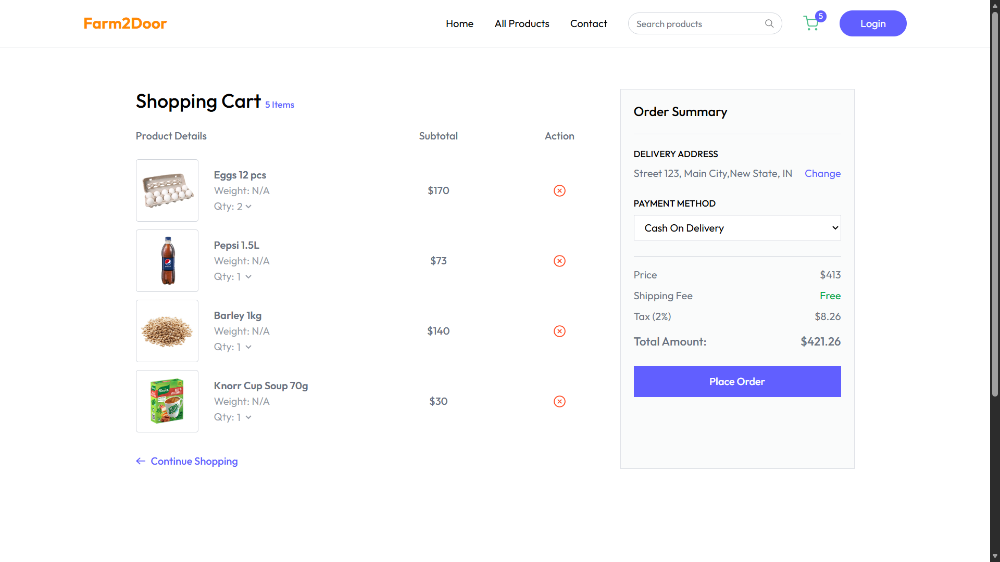

# 🌱 Farm2Door - Online Grocery Delivery Platform

[](https://app.netlify.com/projects/farm2door-app/deploys)


## 📌 Overview

Farm2Door is a full-stack MERN (MongoDB, Express.js, React.js, Node.js) online grocery delivery platform that connects customers directly with fresh farm produce. Users can browse products, manage carts, place orders, and track order history through a modern and responsive interface.

---

## 🚀 Live Demo

🌐 Live Website: https://farm2door-app.vercel.app

### Quick Links

- Frontend: https://farm2door-app.vercel.app
- Backend API: https://farm2-door-ivory.vercel.app

---

## ✨ Features

### 👤 User Features

- User Registration & Login
- JWT Authentication & Authorization
- Browse Products by Categories
- Product Search & Filtering
- Add/Remove Items from Cart
- Update Cart Quantity
- Place Orders
- View Order History
- Manage User Profile

### 🛠️ Admin Features

- Admin Dashboard
- Product Management (CRUD)
- Order Management
- User Management
- Inventory Tracking

---

## 📸 Screenshots

### 🏠 Home Page



### 🚮 Login Page



### 🚮 Signup Page



### 🛒 Product Listing



### 🔍 Best Seller Products



### 🔍 Product Details



### 🔍 Category Details



### 🛍️ Shopping Cart



### 📦 Orders


### ⚙️ Admin Dashboard


---

## 🏗️ System Architecture

```text
Client (React)
      │
      ▼
REST APIs (Express.js)
      │
      ▼
Node.js Server
      │
      ▼
MongoDB Database
```

---

## 🛠️ Tech Stack

| Category         | Technologies                  |
| ---------------- | ----------------------------- |
| Frontend         | React.js, React Router, Axios |
| Backend          | Node.js, Express.js           |
| Database         | MongoDB, Mongoose             |
| Authentication   | JWT, bcryptjs                 |
| State Management | Context API / Redux           |
| Styling          | Tailwind CSS                  |
| Deployment       | Vercel, Render, MongoDB Atlas |

---

## 📂 Project Structure

```bash
Farm2Door/
│
├── client/
│   ├── public/
│   ├── screenshots/
│   ├── src/
│   │   ├── assets/
│   │   ├── components/
│   │   ├── pages/
│   │   ├── context/
│   │   ├── services/
│   │   └── App.jsx
│
├── server/
│   ├── controllers/
│   ├── middleware/
│   ├── models/
│   ├── routes/
│   ├── config/
│   └── server.js
│
├── README.md
└── package.json
```

---

## ⚙️ Installation & Setup

### Clone the Repository

```bash
git clone https://github.com/prakashverma-dev/Farm2Door.git
cd Farm2Door
```

### Install Dependencies

#### Frontend

```bash
cd client
npm install
```

#### Backend

```bash
cd server
npm install
```

### Configure Environment Variables

Create a `.env` file inside the server directory:

```env
PORT=5000

MONGODB_URI=your_mongodb_connection_string

JWT_SECRET=your_secret_key

CLIENT_URL= https://farm2door-app.netlify.app/
```

### Run the Application

#### Backend

```bash
npm run server
```

#### Frontend

```bash
npm run dev
```

---

## 🔑 API Endpoints

### Authentication

```http
POST /api/auth/register
POST /api/auth/login
GET  /api/auth/profile
```

### Products

```http
GET    /api/products
GET    /api/products/:id
POST   /api/products
PUT    /api/products/:id
DELETE /api/products/:id
```

### Orders

```http
POST /api/orders
GET  /api/orders/my-orders
```

---

## 📈 Future Enhancements

- Razorpay Payment Gateway Integration
- Wishlist Functionality
- Real-Time Order Tracking
- Product Reviews & Ratings
- AI-Based Product Recommendations
- Email Notifications
- Dark Mode Support

---

## 🤝 Contributing

Contributions are welcome!

1. Fork the repository
2. Create your feature branch

```bash
git checkout -b feature/new-feature
```

3. Commit your changes

```bash
git commit -m "Add new feature"
```

4. Push to the branch

```bash
git push origin feature/new-feature
```

5. Open a Pull Request

---

## 📄 License

This project is licensed under the MIT License.

---

## 👨‍💻 Author

**Prakash Kumar Verma**

- GitHub: https://github.com/prakashverma-dev/Farm2Door
<!-- - LinkedIn: https://linkedin.com/in/yourprofile -->

---

⭐ If you found this project useful, please give it a star on GitHub!
